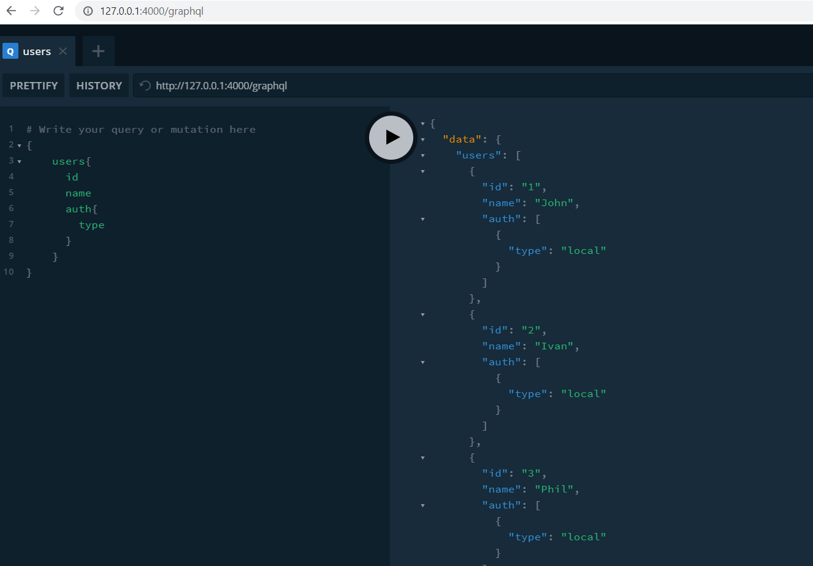

# Typescript GraphQl Sequelize ORM NodeJS template 

- NodeJS backend
  - GraphQl
  - Apollo server express
  - Typescript
- Maria DB (Docker, Sequelize ORM)
  - Migration
  - Models
  - Seeders
- GraphQl
  - context {db}
  - documentation

## Start

```sh
docker-compose up -d

tsc ./src/database/migrations/20190928164355-create-users.ts
tsc ./src/database/seeders/20190928164355-seed-users.ts

sequelize-cli db:migrate
sequelize-cli db:seed:all
```

## Dev env

```sh
npm run dev
```

## Chack API
http://127.0.0.1:4000/graphql

